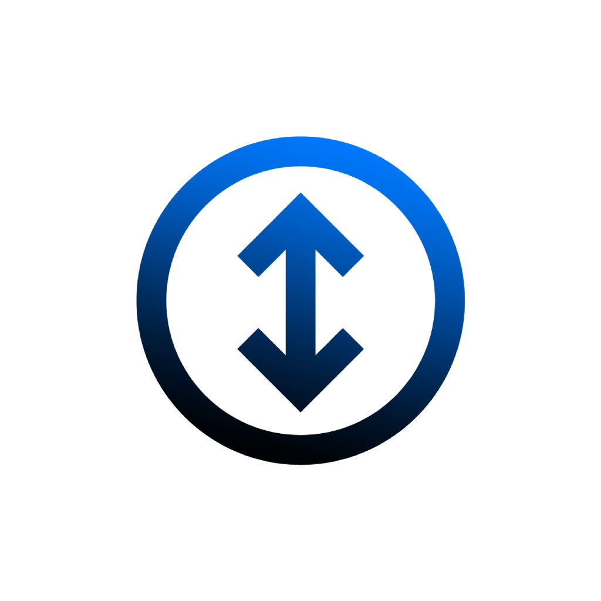

# Scrollapp

[](https://github.com/fromis-9/scrollapp/releases)

A macOS utility that brings Windows-style auto-scrolling to macOS. Middle-click anywhere to enable auto-scroll mode, then move your cursor to control scrolling speed and direction.



## Features

- **Auto-scrolling**: Activate with configurable mouse/key combinations, move cursor to control scrolling
- **7 Activation Methods**: Choose from middle-click, modified clicks, side buttons, or double-click
- **Trackpad Support**: Option+Scroll activation for trackpad users
- **Adjustable Sensitivity**: Slider control from 0.2x to 3.0x speed with exponential slow-speed scaling
- **Intuitive Controls**: Move cursor up/down to control scroll direction and speed
- **Customizable Direction**: Option to invert scrolling direction based on preference
- **Launch at Login**: Optional automatic startup
- **Menu Bar Integration**: Quick access via status menu in the menu bar

## Installation

1. **Download**: Download the latest release from the [Releases](https://github.com/fromis-9/scrollapp/releases) page.
2. **Install**: Open the DMG file and drag Scrollapp to your Applications folder.
3. **Security Override**: Since the app is distributed without Apple notarization, you'll need to manually allow it:
   - **Method 1**: Right-click on Scrollapp.app → "Open" → "Open" in the dialog
   - **Method 2**: If you see "can't be opened" error, go to System Settings → Privacy & Security → scroll down to find "Scrollapp was blocked" → click "Open Anyway"
4. **Grant Permissions**:
   - When prompted, grant Accessibility and Input Monitoring permissions.
   - If you miss a prompt, you can grant permissions manually in System Settings:
     - Go to `System Settings > Privacy & Security > Accessibility` and add Scrollapp.
     - Go to `System Settings > Privacy & Security > Input Monitoring` and enable Scrollapp.
   - You may need to restart the app after granting permissions.

## How to Use

### Activating Auto-scroll

**With Mouse (Configurable):**
Choose your preferred activation method from the menu bar:
- **Middle Click** (default)
- **Shift + Middle Click**
- **Cmd + Middle Click** 
- **Option + Middle Click**
- **Mouse Button 4** (side button)
- **Mouse Button 5** (side button)
- **Double Middle Click**

Use your chosen method to toggle auto-scroll on/off, or click any other mouse button to exit.

**With Trackpad:**
- Hold Option key and perform a two-finger scroll to activate auto-scroll
- Click anywhere to exit auto-scroll mode

### Controlling Scrolling

Once auto-scroll is activated:
- Move cursor **up** to scroll **up**
- Move cursor **down** to scroll **down**
- Move further from the center point for faster scrolling
- Move closer to the center point for slower, more precise scrolling

### Customization

**Scroll Speed:**
- Use the sensitivity slider in the menu (0.2x - 3.0x)
- Speeds below 1.0x use exponential scaling for fine control
- Real-time adjustment with immediate feedback

**Activation Method:**
- Choose from 7 different mouse/key combinations
- Avoid conflicts with browser middle-click link opening
- Supports modifier keys (Shift, Cmd, Option) and side buttons

### Menu Options

Access additional options from the menu bar icon:
- **Start/Stop Auto-Scroll** - Manual toggle
- **Scroll Speed** - Sensitivity slider (0.2x - 3.0x)
- **Activation Method** - Choose your preferred mouse/key combination
- **Invert Scrolling Direction** - Reverse up/down behavior
- **Launch at Login** - Automatic startup option
- **About Scrollapp** - App information and usage tips

## System Requirements

- macOS 11.0 (Big Sur) or later
- Mouse with middle button, side buttons, or trackpad support
- Compatible with both Intel and Apple Silicon Macs

## Privacy & Security

- **Permissions**: Scrollapp requires Input Monitoring permissions to detect mouse/trackpad events. It does not collect or transmit any personal data.
- **Code Signing**: The app is ad-hoc signed for free distribution. While this triggers macOS security warnings, the source code is fully open and auditable on GitHub.

## License

[GNU General Public License v3.0](LICENSE)

## Building from Source

To build Scrollapp from source:

1. **Clone the repository:**
   ```bash
   git clone https://github.com/your-username/scrollapp.git
   cd scrollapp
   ```

2. **Open in Xcode:**
   ```bash
   open Scrollapp.xcodeproj
   ```

3. **Build the app:**

   **Option A: With Apple Developer Program Account**
   - In Xcode, select **Product** → **Archive**
   - Click **Distribute App** → **Copy App**
   - Choose a location to export the built app

   **Option B: Without Developer Account (Free)**
   - In Xcode, select **Product** → **Build** (⌘+B)
   - Navigate to the build folder: **Product** → **Show Build Folder in Finder**
   - Find your app in `Build/Products/Release/Scrollapp.app`
   - Copy the app to your Applications folder or wherever you'd like

The project is configured to build universal binaries that work on both Intel and Apple Silicon Macs.

## Feedback and Contributions

Feedback and contributions are welcome! Please feel free to submit issues or pull requests.
